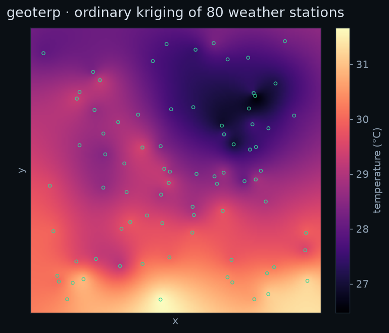
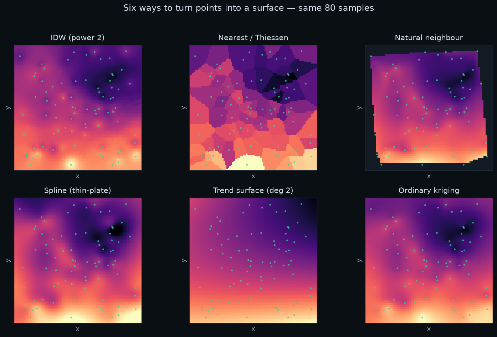
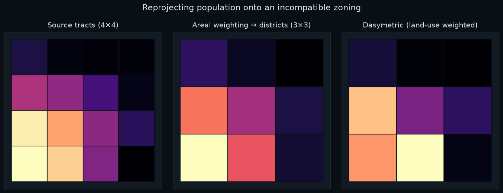
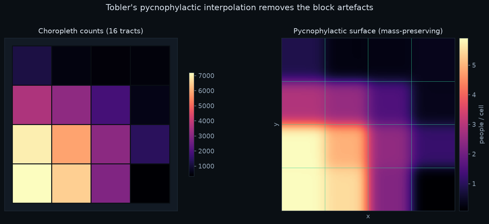
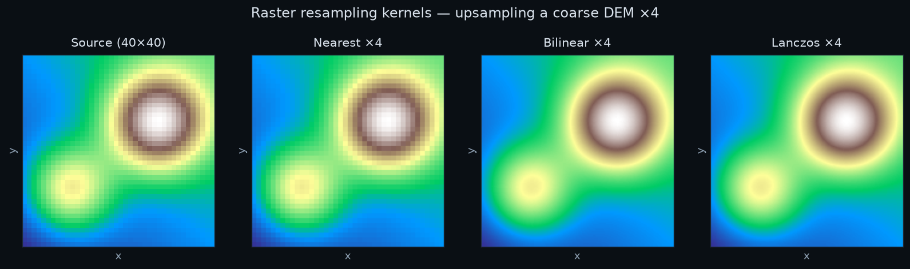

# geoterp

**Spatial interpolation for vector *and* raster data — one consistent Python API and CLI.**

`geoterp` collects the interpolation methods a GIS analyst actually reaches for
— deterministic and geostatistical point methods, areal (polygon-to-polygon)
methods, and raster resampling/aggregation — behind a single, predictable
interface. Point and raster methods return a `RasterGrid` you can save straight
to GeoTIFF; polygon methods return GeoDataFrames.



Where a best-in-class open-source tool already exists it is used directly
(SciPy for splines and KD-trees, PyKrige for kriging, GDAL/rasterio for raster
kernels, GeoPandas/Shapely for overlays). Where no maintained tool exists —
Sibson natural-neighbour, Tobler pycnophylactic interpolation, local polynomial
regression — `geoterp` implements it from scratch, carefully and with tests.

---

## What's covered

| Family | Methods |
| --- | --- |
| **Points → surface** (deterministic) | Inverse Distance Weighting · Nearest-neighbour / Thiessen · Natural neighbour (Sibson) · Spline (RBF / thin-plate) · Trend surface (global polynomial) · Local polynomial (LOESS-style) |
| **Points → surface** (geostatistical) | Ordinary & Universal Kriging |
| **Points → vector** | Thiessen / Voronoi polygons |
| **Polygons → polygons** | Areal weighting · Dasymetric mapping · Pycnophylactic (Tobler) |
| **Raster → raster** | Nearest · Bilinear · Cubic convolution · Cubic spline · Lanczos / sinc · Aggregation (mean, sum, min, max, median, mode) |

---

## Install

```bash
pip install geoterp
# or, from a checkout:
pip install -e ".[dev]"
```

The scientific/geospatial stack (`numpy`, `scipy`, `shapely`, `geopandas`,
`rasterio`, `pyproj`, `pykrige`, `scikit-learn`) is installed automatically.
Tested on Python 3.10–3.14.

---

## 60-second tour

Every example below uses the bundled sample dataset — a fictional 10 km × 10 km
city with 80 weather stations, census tracts, land-use zones and a DEM.

```python
import geoterp
from geoterp import datasets

stations = datasets.load_stations()      # GeoDataFrame of points, "temperature" column

# Points → surface. Any method takes the same shape of call and returns a RasterGrid.
surface = geoterp.idw(stations, "temperature", resolution=200, power=2)
surface = geoterp.kriging(stations, "temperature", resolution=200, variogram_model="spherical")
surface = geoterp.spline(stations, "temperature", resolution=200, kernel="thin_plate_spline")

surface.to_geotiff("temperature.tif")    # save
arr = surface.data                       # or grab the NumPy array (north-up)
surface.plot()                           # quick matplotlib look
```

You can feed points as a GeoDataFrame, a file path, or plain arrays:

```python
geoterp.idw("stations.geojson", value="temperature", resolution=200)
geoterp.idw(x, y=y, z=z, cellsize=50)
```

### Points → surface, six ways



```python
geoterp.idw(stations, "temperature", power=2, neighbors=12)
geoterp.nearest(stations, "temperature")                       # Thiessen raster
geoterp.natural_neighbor(stations, "temperature")              # Sibson, from scratch
geoterp.spline(stations, "temperature", kernel="thin_plate_spline")
geoterp.trend_surface(stations, "temperature", degree=2)       # global polynomial
geoterp.local_polynomial(stations, "temperature", degree=1)    # LOESS-style
geoterp.kriging(stations, "temperature", method="ordinary")    # + variance
```

Thiessen polygons as *vector* output:

```python
polys = geoterp.voronoi_polygons(stations, "temperature")      # GeoDataFrame
```

Kriging can also return its estimation variance:

```python
surface, variance = geoterp.kriging(stations, "temperature", return_variance=True)
```

### Polygons → polygons

Re-express a value measured on one set of zones onto an incompatible set —
preserving total mass.



```python
src, tgt, landuse = datasets.load_source_zones(), datasets.load_target_zones(), datasets.load_landuse()

# Area-of-overlap weighting (extensive counts, or intensive=False for rates)
geoterp.areal_weighting(src, tgt, "population")

# Dasymetric: refine with ancillary land-use density weights
geoterp.dasymetric(src, tgt, "population", landuse, weight_col="weight")

# Pycnophylactic (Tobler): smooth, mass-preserving surface, then re-aggregate
geoterp.pycnophylactic(src, "population", resolution=140)                # RasterGrid
geoterp.pycnophylactic_to_polygons(src, tgt, "population")               # GeoDataFrame
```



### Raster → raster



```python
dem = datasets.load_dem()

geoterp.resample(dem, scale=2, method="bilinear")      # or nearest / cubic / cubic_spline / lanczos
geoterp.resample(dem, cellsize=25, method="lanczos")
geoterp.resample(dem, shape=(512, 512), method="cubic")

geoterp.aggregate(dem, factor=4, method="average")     # or sum / min / max / median / mode
```

---

## Command line

`geoterp` installs a CLI grouped as `geoterp <family> <method>`:

```bash
# Write the sample dataset to disk to experiment with
geoterp sample --outdir ./sample_data

# Points → surface
geoterp point idw      sample_data/stations.geojson --value temperature --resolution 200 -o idw.tif
geoterp point kriging  sample_data/stations.geojson --value temperature --variogram spherical -o krig.tif
geoterp point voronoi  sample_data/stations.geojson --value temperature -o thiessen.geojson

# Polygons → polygons
geoterp polygon areal      sample_data/source_zones.geojson sample_data/target_zones.geojson --value population -o areal.geojson
geoterp polygon dasymetric sample_data/source_zones.geojson sample_data/target_zones.geojson \
        --value population --ancillary sample_data/landuse.geojson --weight-col weight -o dasy.geojson
geoterp polygon pycno      sample_data/source_zones.geojson --value population --resolution 140 -o pycno.tif

# Raster → raster
geoterp raster resample  sample_data/dem.tif --scale 2 --kernel lanczos -o dem_hi.tif
geoterp raster aggregate sample_data/dem.tif --factor 4 --stat average -o dem_lo.tif
```

Run `geoterp --help` or `geoterp point --help` for the full option list.

---

## Sample dataset

The `geoterp.datasets` module generates a small, self-consistent scenario
deterministically (fixed seed), so examples and tests are reproducible without
shipping binary files:

| Loader | Geometry | Attributes |
| --- | --- | --- |
| `load_stations()` | 80 points | `temperature` (°C), `elevation` (m) |
| `load_source_zones()` | 4×4 polygons | `population` |
| `load_target_zones()` | 3×3 polygons | (target zoning) |
| `load_landuse()` | 6×6 polygons | `landuse`, `weight` |
| `load_dem()` | raster | smooth elevation surface |

`geoterp sample --outdir DIR` (or `datasets.make_sample_dataset(dir)`) writes them
all to disk as GeoJSON / CSV / GeoTIFF. A pre-generated copy also lives in
[`sample_data/`](sample_data/).

---

## Choosing a method

- **IDW** — fast, intuitive, always in-range; can show "bull's-eyes" around samples.
- **Nearest / Thiessen** — categorical or where a hard partition is wanted.
- **Natural neighbour** — smooth, in-range, parameter-free; great default for clean data.
- **Spline (thin-plate)** — smooth surfaces from sparse data; can overshoot with noise.
- **Trend surface** — captures broad regional drift, not local detail.
- **Local polynomial** — locally adaptive, between IDW and a global trend.
- **Kriging** — when you want a statistical model and an uncertainty estimate.
- **Areal weighting** — the honest baseline for polygon-to-polygon.
- **Dasymetric** — when you have ancillary data about where the quantity concentrates.
- **Pycnophylactic** — smooth, mass-preserving surfaces from choropleth counts.

---

## Development

```bash
pip install -e ".[dev]"
pytest                          # 67 tests: invariants, edge cases, CLI end-to-end
python examples/make_blog_figures.py docs/img   # regenerate the figures
```

The test suite leans on two invariants that any correct interpolator must
satisfy — **constant-field reproduction** and (for exact interpolators)
**linear-field reproduction** — plus **mass preservation** for the polygon
methods.

## License

MIT © Pratik Mahadik. See [LICENSE](LICENSE).
